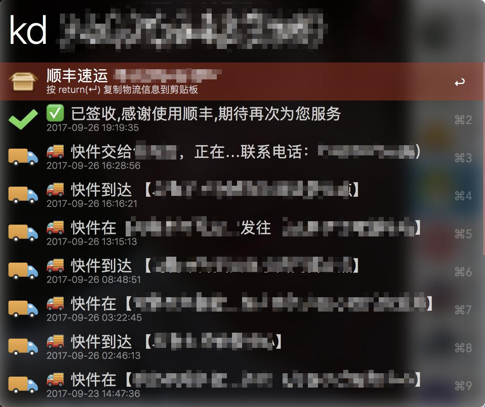

Kuaidi | 快递查询
===============

## Notice

**请注意，以下内容会直接影响到您的使用体验，建议阅读后再进行使用，以免出现不必要的麻烦**

 1. 在使用过程中请避免频繁查询，否则极易被阿里风控，从而导致无法查询。
    建议复制好完整单号，查询时直接粘贴，避免二次请求。

 2. 由于查询顺丰需要收/发件人的联系方式作为验证手段，防止泄漏用户隐私，因此该 Workflow 无法查询顺丰单号

## Features

 - ~使用快递100官网API完成快递查询操作~   v1.2.0 使用菜鸟裹裹作为数据源
 - 支持回车复制完整物流信息文字

## Download

[Github Release](https://github.com/deamwork/kuaidi-workflow/releases)

## Changelog

- Sep 6, 2019
  - 使用了新的数据源：菜鸟裹裹
  - 不再使用emoji
  - 修复了快递100接口反复无常的问题 (fix #1)

- Aug 15, 2019
  - 支持 Alfred 4
  - 更新快递100官网接口
  - 添加多个异常处理
  - 添加自动更新功能
  - 代码开源于 Github

- Oct 10, 2017
  - 发布首个版本，支持 Alfred 3

## References

- https://github.com/joetannenbaum/alfred-workflow

## License

本项目使用 BSD-3-Clause 协议发布开源。

